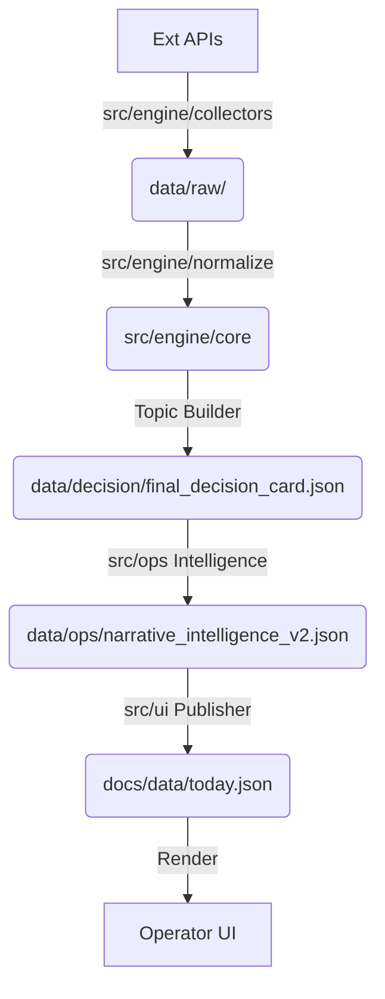

# Project Architecture Map - HoinInsight

이 문서는 프로젝트의 전체 구조를 도식화하며, 각 레이어의 역할과 데이터 흐름을 정의합니다.

## 1. 계층형 구조 (Layered Architecture)

### [A] Data Collection Layer
- **역할**: 외부 API(FRED, ECOS, Stooq 등) 및 파이프라인으로부터 raw 데이터를 수집합니다.
- **주요 위치**:
  - `src/engine/collectors/`: 핵심 매크로/시장 데이터 수집기
  - `src/events/collectors/`: 특정 도메인(Capital, Policy 등) 이벤트 수집기
  - `src/collectors/`: 범용 수집기 (분산됨)
- **데이터 흐름**: External API → `data/raw/`

### [B] Engine Core Layer
- **역할**: 수집된 데이터를 정규화(Normalization)하고, 이상징후(Anomaly)를 탐지하며, 기초 토픽을 생성합니다.
- **주요 위치**:
  - `src/engine/normalize/`: 시계열 데이터 정규화 로직
  - `src/anomaly_detectors/`: 이상징후 탐지 알고리즘
  - `src/topics/scoring.py`: 기초 점수 산정
  - `src/topics/gate/`: 발화 적합성 판단 (Speakability)
- **핵심 원칙**: 엔진은 순수 계산만 수행하며, UI나 퍼블리싱 로직을 포함하지 않음.

### [C] Intelligence Extensions
- **역할**: 엔진 결과물에 지기(Why-now), 서사(Narrative), 영상 가치(Video) 등 상위 판단 레이어를 추가합니다.
- **주요 위치**:
  - `src/ops/narrative_intelligence_layer.py`: 서사 완성도 및 NS 계산
  - `src/ops/video_intelligence_layer.py`: 영상 제작 파급력 및 VS 계산
  - `src/ops/whynow_trigger_layer.py`: 시의성 분류
- **데이터 흐름**: Engine Output → Intelligence Layer → `data/ops/`

### [D] Publisher Layer (SSOT)
- **역할**: 최종 결정 데이터를 UI에서 소비 가능한 형태(SSOT)로 가공하여 `docs/data`로 배포합니다.
- **주요 위치**:
  - `src/ui/run_publish_ui_decision_assets.py`: 메인 퍼블리셔 (배포 게이트웨이)
  - `src/reporters/`: 리포트 형식 JSON 생성
- **핵심 원칙**: 퍼블리셔는 데이터 복사 및 구조 정렬만 수행.

### [E] UI Layer
- **역할**: 배포된 SSOT 데이터를 기반으로 운영자 화면을 렌더링합니다.
- **주요 위치**:
  - `docs/ui/`: 현대적인 JS 모듈 기반 UI 코드
  - `docs/index.html`: 메인 앱 진입점
- **핵심 원칙**: UI는 가공을 최소화하고 렌더링에만 집중.

### [F] Legacy / Experimental
- **역할**: 과거 대시보드 및 실험용 스크립트, 포렌식 리포트를 포함합니다.
- **주요 위치**:
  - `docs/legacy/`: (삭제 예정) 구형 대시보드
  - `src/legacy_shims/`: 호환성 유지용 코드
  - `archive/`: (신설 예정) 격리가 필요한 실험용 리소스

---

## 2. 데이터 흐름도 (Data Flow)

