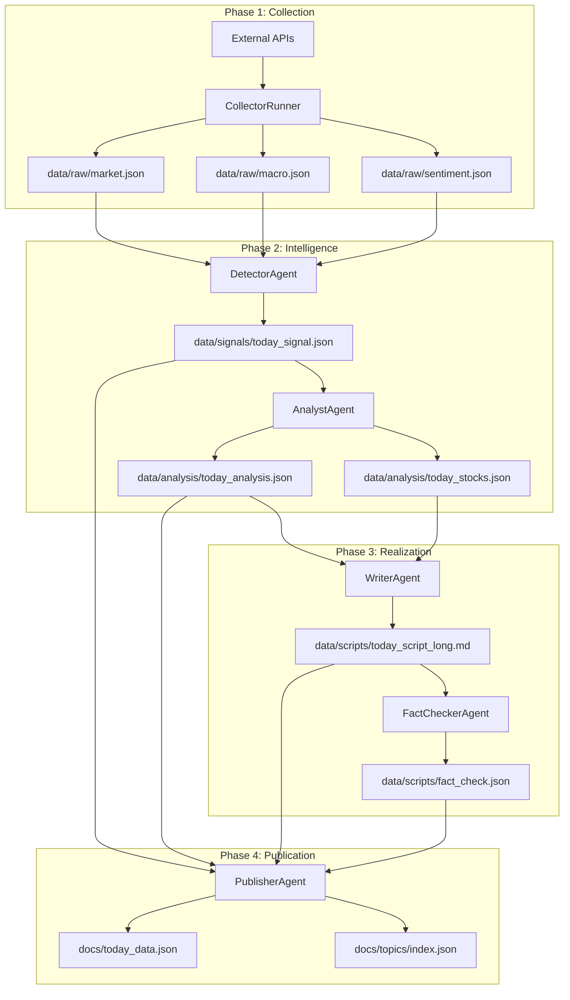

# HOIN Insight 데이터 흐름 맵 (Actual Data Flow)
v1.0 | 2026-04-20 감사 수행

## 1. 외부 소스 → Raw Data 입수 체계

| 소스 (Source) | 수집 경로 (Collector/Agent) | 출력 파일 (Output) | 구현 방식 |
| :--- | :--- | :--- | :--- |
| **Market (Charts)** | `MarketAgent` / `collector.py` | `market.json` | Yahoo Chart API 직접 호출 (Requests) |
| **Macro (US)** | `MacroAgent` / `fred_api` | `fred.json` | FRED API (US Interest Rates, M2, CPI 등) |
| **Macro (KR)** | `MacroAgent` / `ecos_api` | `ecos.json` | BOK ECOS API (KR Base Rate, Export 등) |
| **Consensus** | `ConsensusCollector` | `consensus.json` | Finnhub / FRED 경제 캘린더 및 서프라이즈 계산 |
| **Smart Money** | `COTCollector` | `cot.json` | CFTC COT Report (cot-reports Python Lib) |
| **Sentiment** | `SentimentAgent` | `sentiment.json` | 글로벌 경제 RSS (WSJ, FT, CNBC, 연합뉴스 등) |
| **Corporate** | `DartAgent` | `dart.json` | OpenDART (공시 기반 테마 키워드 추출) |
| **Put/Call** | `PutCallCollector` | `putcall.json` | CBOE Web API (Cloudflare 403 대응 중) |

## 2. 내부 데이터 파이프라인 산출물 상세

## 3. 핵심 Raw Data 명세 (market.json)
- **주요 필드**: `data`, `history_90d`, `multi_period_stats`
- **통계 데이터**: 각 지표별 5D/20D/60D 평균, 1D/5D 변화율, **20D Z-score**
- **히스토리 데이터**: 최근 30일간의 종가 추이(`trend`) 포함

## 4. 최종 사용자 서비스 접점
- **Dashboard**: `docs/index.html` → `docs/today_data.json` 로드 (Client-side Rendering)
- **Archive**: `docs/topics/index.json` 및 `docs/topics/items/*.json` (과거 기록 저장소)
