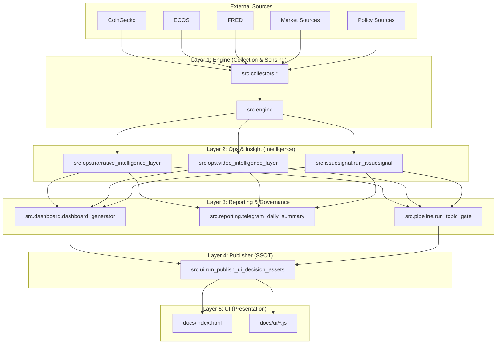

# Runtime Architecture Map (Phase 20 Audit)

이 문서는 `full_pipeline.yml`의 실제 실행 경로와 코드 간의 `import` 관계를 분석하여 작성된 **실제 작동 구조도**입니다.

## 1. Runtime Flow Diagram (Mermaid)

## 2. Key Data Contracts (SSOT)

| Layer | Responsibility | Input Path (Primary) | Output Path (Primary) |
| :--- | :--- | :--- | :--- |
| **Engine** | Sensing & Raw Analysis | API Keys / RSS | `data/raw/`, `data/processed/` |
| **Ops** | Narrative & Video Selection | `data/processed/` | `data/narratives/`, `data/ops/` |
| **Publisher** | UI Sync & Manifesting | `data/narratives/`, `data/ops/` | `docs/data/` |
| **UI** | Visualization | `docs/data/` | Browser Render |

## 3. Data Flow Artifacts (Production)
이 경로는 런타임에서 실제로 데이터가 생성되고 소비되는 SSOT 저장소입니다.
- `docs/data/decision/`: 최종 결정 및 편집자 카드
- `docs/data/ui/`: UI 렌더링용 집계 데이터
- `docs/data/ops/`: 비디오 후보군 및 시스템 상태
- `docs/data/reports/`: 데일리 브리핑 및 차트
