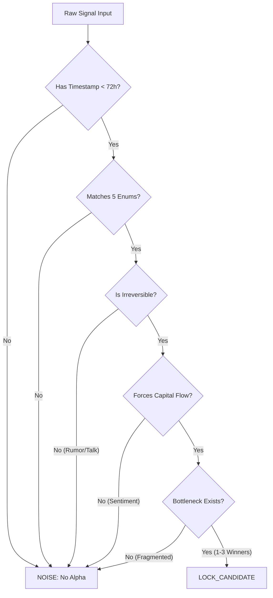

# WHY NOW TRIGGER ENGINE

**Version:** 1.0 (2026-01-29)
**Role:** The Gatekeeper. The first filter of the Economic Hunter Pipeline.
**Constraint:** Must align strictly with `ECONOMIC_HUNTER_TOPIC_DNA.md`.

---

## 1. Trigger Classification (The Strict Enum)
Only the following 5 trigger types are recognized. Anything else is `NOISE`.

| Trigger Type | Definition | Key Keyword Examples |
| :--- | :--- | :--- |
| **POLICY_TRIGGER** | A law passed, a subsidy finalized, or a trade ban enforced. Must be *enacted*, not just debated. | `Passed`, `Enforced`, `Banned`, `Signed`, `Subsidy Confirmed` |
| **EARNINGS_TRIGGER** | A specific company report revealing a *new* structural reality (CAPEX surge, Order backlog). Not just "beat eps". | `CAPEX Guidance Up`, `Backlog Record`, `New Segment Revenue` |
| **TECH_PHASE_TRIGGER** | A product *release* or *standard adoption* that opens a new market phase. Not R&D announcements. | `Launched`, `Released`, `Standard Ratified`, `Mass Production Start` |
| **SUPPLY_CHAIN_TRIGGER** | A massive disruption or constraint forcing price/volume changes. | `Shortage`, `Strike`, `Plant Shutdown`, `Logistics Blockage` |
| **SHOCK_TRIGGER** | Geopolitical war, pandemic, or natural disaster forcing immediate capital checks. | `Invaded`, `Sanctioned`, `Destroyed`, `Crisis Declared` |

---

## 2. Decision Logic (Pseudocode)

The engine rejects any signal that lacks a `Confirm_Timestamp` or cannot pass the `Necessity_Test`.

```python
def classify_signal(signal):
    # STEP A: Fact Check (The "Today" Rule)
    if not signal.has_timestamped_event_in_last_72h():
        return "NOISE" # Rejected: Old news or vague speculation

    # STEP B: Type Classification
    trigger_type = match_strict_enum(signal.event_type)
    if not trigger_type:
        return "NOISE" # Rejected: Not one of the 5 allowed types

    # STEP C: The DNA Trinity Test (Constitution Check)
    # 1. Why Now? (Is it irreversible?)
    if not is_irreversible(signal):
        return "NOISE" # Example: "Rumors of tax cuts" -> Reversible -> Noise

    # 2. Structural Flow? (Is capital FORCED to move?)
    if not is_forced_capital_flow(signal):
        return "NOISE" # Example: "Consumers like red shoes" -> Preference, not force -> Noise

    # 3. Inevitable Bottleneck? (Does it collapse to 1-3 winners?)
    if is_fragmented_market(signal.sector):
        return "NOISE" # Example: "App Store Explosion" -> Too many players -> Noise

    # If all pass:
    return "LOCK_CANDIDATE"
```

---

## 3. Decision Flow Diagram



---

## 4. Rejection Examples (The Anti-Pattern)

| Signal Input | Classification | Reason for Rejection |
| :--- | :--- | :--- |
| "Tesla stock is up 5% today because people love EVs" | **NOISE** | No timestamped event. Pure sentiment. |
| "Government *considering* a ban on plastic" | **NOISE** | `POLICY_TRIGGER` fail. "Considering" is not irreversible. |
| "New startup creates an AI agent" | **NOISE** | `TECH_PHASE_TRIGGER` fail. Fragmented market. No bottleneck yet. |
| "Oil might go up if winter is cold" | **NOISE** | `SHOCK_TRIGGER` fail. Speculation, not an event. |
| "Apple released iPhone 25" | **NOISE** | `TECH_PHASE_TRIGGER` pass, but `Structural Flow` fail? Arguable. Usually noise unless it changes the *industry standard* (e.g., USB-C forced adoption). |

## 5. Critical Acceptance Criterion
**"Why Today?" Sentence Rule**:
> *"We must discuss this today because [Event X] happened [Time Y], which forces [Industry Z] to spend [Amount $] on [Bottleneck A] immediately."*

If the topic cannot fill this template -> **REJECT**.
