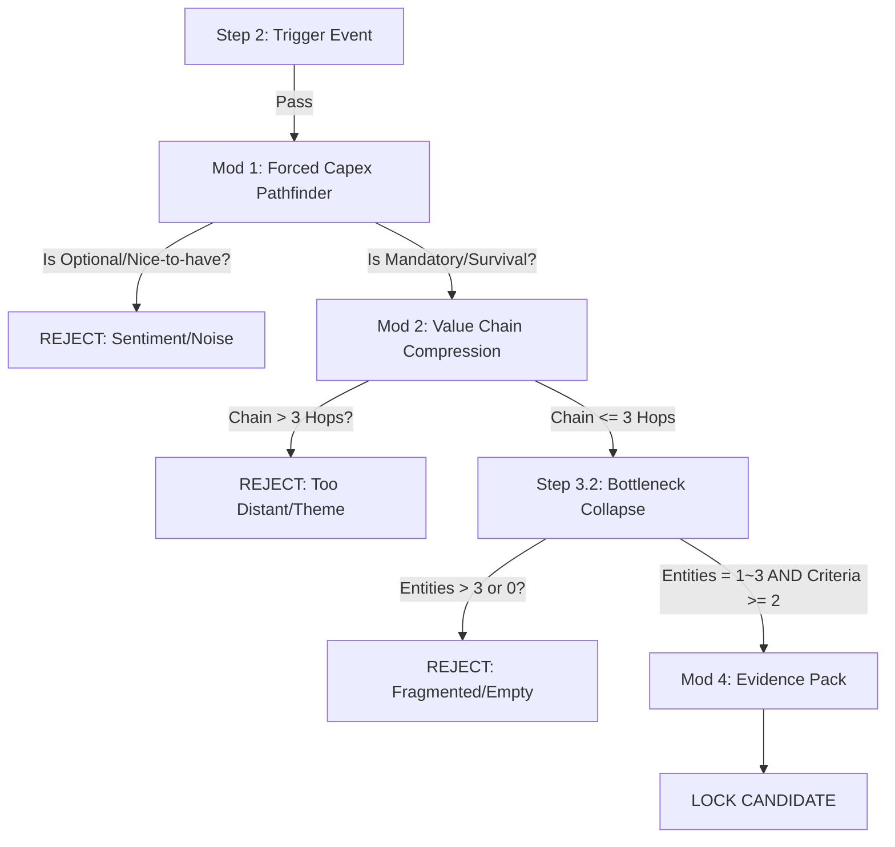

# STRUCTURAL FLOW ENGINE (Step 3.1)

**Role:** Transforms a Step 2 Trigger Event into a confirmed "Forced Capital Flow" and compresses the value chain.
**Input:** Validated `Why Now` Trigger (from Step 2).
**Output:** Compressed Value Chain (3 Hops Max).

---

## 1. Unified Decision Pipeline (Step 2 → Step 3)

---

## 2. Module 1: FORCED_CAPEX_PATHFINDER

### Objective
Identify the specific line item where money *must* be spent immediately.

### Logic
1.  **Input Analysis**: Review the Trigger Event.
2.  **The "Or Else" Test**: ask "If they don't buy this, what happens?"
    *   *Answer: "They make less profit"* → **REJECT** (Optional/Efficiency).
    *   *Answer: "They go to jail / die / cannot produce"* → **PASS** (Forced).
3.  **Capex Identification**: Name the physical asset or service.
    *   *Example:* "AI Server" (Pass), "Better Office Chairs" (Reject).

### Rules
*   **Musy-Have vs. Nice-to-Have**: ONLY Survival, Law, or Critical Continuity allowed.
*   **Immediacy**: The check must be written in the current budget cycle (next 12 months).

---

## 3. Module 2: VALUE_CHAIN_COMPRESSION

### Objective
Map the path from the spender to the beneficiary in **3 hops or less**.

### Logic
Construct the chain: `[Source of Money]` → `[Integrator/Channel]` → `[Target Bottleneck]`

*   **Hop 1 (The Spender)**: Government, Hyperscaler, Shipowner.
*   **Hop 2 (The Builder)**: EPC, OEM, Foundry (Optional, can skip if Spender buys direct).
*   **Hop 3 (The Bottleneck)**: The component/material/ip provider we are hunting.

### Rules
*   **Max 3 Hops**: If you need 4 steps to explain why X benefits (e.g., *Fed cuts rates → Consumer spends more → Car sales up → Tire maker sells more → Rubber supplier wins*), it is **REJECTED**. It is a "Theme," not a Structural Flow.
*   **Directionality**: Flow must be downstream (Money → Asset).

### Output Format
*   **Chain**: `[Entity A]` --buys--> `[Entity B]` --requires--> `[Entity C]`
